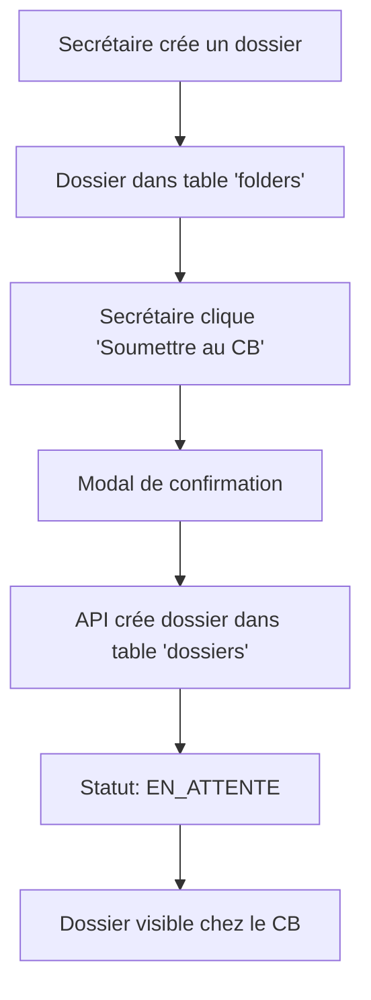

# 📤 Fonctionnalité de Soumission des Dossiers - ACGE

## 🎯 Vue d'ensemble

La fonctionnalité de soumission des dossiers permet à la secrétaire de soumettre ses dossiers pour validation par le Contrôleur Budgétaire (CB). Une fois soumis, le dossier passe de la table `folders` vers la table `dossiers` avec le statut `EN_ATTENTE`.

## 🔧 Implémentation

### 1. API de Soumission
- **Endpoint**: `POST /api/folders/[id]/submit`
- **Fichier**: `src/app/api/folders/[id]/submit/route.ts`
- **Fonctionnalité**: 
  - Vérifie que le dossier existe dans la table `folders`
  - Crée un nouveau dossier dans la table `dossiers` avec statut `EN_ATTENTE`
  - Génère un numéro de dossier unique
  - Gère les erreurs et conflits

### 2. Interface Utilisateur
- **Page**: `src/app/(protected)/folders/page.tsx`
- **Composant**: `src/components/folders/folder-grid-item.tsx`
- **Fonctionnalités**:
  - Bouton "Soumettre au CB" dans le menu d'actions de chaque dossier
  - Modal de confirmation avant soumission
  - Indicateur de chargement pendant la soumission
  - Messages de succès/erreur

### 3. Workflow de Soumission



## 🚀 Comment Tester

### 1. Démarrer l'application
```bash
npm run dev
```

### 2. Se connecter en tant que secrétaire
- Aller sur `http://localhost:3000/login`
- Utiliser les identifiants de la secrétaire

### 3. Créer un dossier
- Aller sur `http://localhost:3000/folders`
- Cliquer sur "Nouveau dossier"
- Remplir les informations et créer le dossier

### 4. Soumettre le dossier
- Dans la liste des dossiers, cliquer sur le menu "..." d'un dossier
- Sélectionner "Soumettre au CB"
- Confirmer dans la modal

### 5. Vérifier chez le CB
- Se connecter en tant que Contrôleur Budgétaire
- Aller sur `http://localhost:3000/cb-dashboard`
- Vérifier que le dossier soumis apparaît dans la liste

## 📋 Données de Test

### Utilisateurs de Test
- **Secrétaire**: ID `cmecmvbvy0000c1ecbq58lmtm`
- **CB**: Utilisateur avec rôle `CONTROLEUR_BUDGETAIRE`

### Structure des Données
```json
{
  "numeroDossier": "DOSS-ACGE-20241201XXX",
  "numeroNature": "NATURE-001",
  "objetOperation": "Description du dossier",
  "beneficiaire": "Bénéficiaire à définir",
  "posteComptableId": null,
  "natureDocumentId": null,
  "secretaireId": "cmecmvbvy0000c1ecbq58lmtm",
  "statut": "EN_ATTENTE"
}
```

## 🔍 Vérifications

### 1. Base de Données
- Vérifier que le dossier apparaît dans la table `dossiers`
- Vérifier que le statut est `EN_ATTENTE`
- Vérifier que les relations sont correctes

### 2. Interface CB
- Le dossier doit apparaître dans `/cb-dashboard`
- Le statut doit être "EN_ATTENTE"
- Les informations du dossier doivent être complètes

### 3. Gestion des Erreurs
- Dossier déjà soumis → Erreur 409
- Dossier inexistant → Erreur 404
- Erreur de base de données → Erreur 500

## 🎨 Interface Utilisateur

### Bouton de Soumission
- **Couleur**: Bleu (`text-blue-600`)
- **Icône**: `Send` de Lucide React
- **Texte**: "Soumettre au CB"

### Modal de Confirmation
- **Titre**: "Soumettre le dossier au CB ?"
- **Description**: Explication du processus
- **Boutons**: "Annuler" et "Soumettre"
- **État de chargement**: "Soumission..." pendant le traitement

## 🔧 Configuration

### Variables d'Environnement
- Aucune configuration supplémentaire requise
- Utilise la configuration Supabase existante

### Dépendances
- `lucide-react` pour les icônes
- `@/components/ui/*` pour les composants UI
- `@/lib/supabase-server` pour la base de données

## 📝 Notes Importantes

1. **Sécurité**: Seuls les utilisateurs avec le rôle `SECRETAIRE` peuvent soumettre des dossiers
2. **Validation**: Le numéro de dossier est généré automatiquement s'il n'est pas fourni
3. **Idempotence**: Un dossier ne peut pas être soumis plusieurs fois
4. **Performance**: La soumission est asynchrone avec indicateur de chargement

## 🐛 Dépannage

### Problèmes Courants
1. **Erreur 404**: Vérifier que l'ID du dossier existe
2. **Erreur 409**: Le dossier a déjà été soumis
3. **Erreur 500**: Problème de base de données ou de configuration

### Logs de Debug
- Les logs sont disponibles dans la console du navigateur
- Les logs serveur sont dans le terminal de développement
- Utiliser `console.log` pour tracer le flux d'exécution

## ✅ Statut d'Implémentation

- [x] API de soumission
- [x] Interface utilisateur
- [x] Modal de confirmation
- [x] Gestion des erreurs
- [x] Types TypeScript
- [x] Tests de base
- [ ] Tests automatisés
- [ ] Documentation complète
